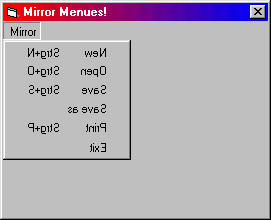



## Mirror Menues\!

### Description

This code flips menue items horizontal!

Just take a look at the screenshot.
 
### More Info
 

             |
---                |---
**Submitted On**   |2000-09-05 15:48:48
**By**             |[Druid Developing](https://github.com/Planet-Source-Code/PSCIndex/blob/master/ByAuthor/druid-developing.md)
**Level**          |Beginner
**User Rating**    |5.0 (15 globes from 3 users)
**Compatibility**  |VB 6\.0
**Category**       |[Custom Controls/ Forms/  Menus](https://github.com/Planet-Source-Code/PSCIndex/blob/master/ByCategory/custom-controls-forms-menus__1-4.md)
**World**          |[Visual Basic](https://github.com/Planet-Source-Code/PSCIndex/blob/master/ByWorld/visual-basic.md)
**Archive File**   |[CODE\_UPLOAD9642952000\.zip](https://github.com/Planet-Source-Code/druid-developing-mirror-menues__1-11274/archive/master.zip)

